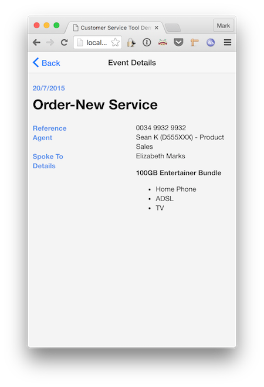
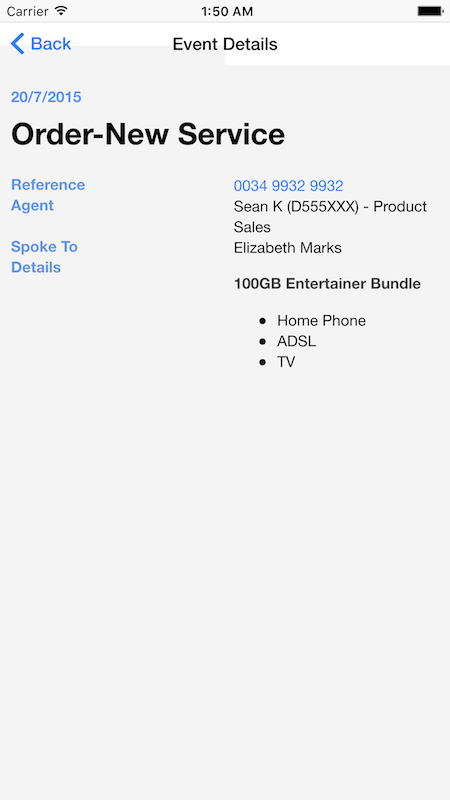

# cst (Customer Service Tool)

A spike to integrate:

* [Reapp](http://reapp.io/) - Reapp is a collection of packages for building user interfaces using React. Apps can be deployed to mobile platforms including iOS and Android using Apache Cordova.
* [Couchbase Server](http://www.couchbase.com/nosql-databases/couchbase-server) - Couchbase is a document-oriented NoSQL database.
* [Spring Boot](http://projects.spring.io/spring-boot/) - Spring Boot is a Java application development framework ideally suited to a [microservices](http://martinfowler.com/articles/microservices.html) architecture.

This project is a demo of a customer service tool that collects events from an analytical pipeline into a serving layer (Couchbase) for delivery to a mobile customer enquiry tool.

### Load Test Data into Couchbase Server

The following test document (fictitious data) will serve our example.

You can insert the document using the [Couchbase Web Console](http://localhost:8091). (The default credentials are Administrator / password, or as you set them during installation.) Give the document the id '2004226978'.

    {
      "name": "Elizabeth Marks",
      "events": [
        {
          "reference": "0034 9932 9932",
          "agentLanId": "D555XXX",
          "subtype": "New Service",
          "agentName": "Sean K",
          "agentOu": "Product Sales",
          "details": "__100GB Entertainer Bundle__\n* Home Phone\n* ADSL\n* TV",
          "time": "2015-07-20 22:18:41.857",
          "type": "Order",
          "status": "Complete (Approved)"
        },
        {
          "type": "Service Request",
          "subtype": "Complaint",
          "time": "2015-06-21 22:18:41.857"
        },
        {
          "type": "Interaction",
          "subtype": "Change of Details",
          "time": "2015-05-22 22:18:41.857"
        },
        {
          "reference": "0034 9932 XXXX",
          "sentTo": "0410 541 XXX",
          "subtype": "Exceed Data Limit",
          "time": "2015-05-15 22:18:41.857",
          "notificationType": "SMS",
          "type": "Notification",
          "message": "Lorem ipsum"
        }
      ],
      "id": "2004226978"
    }

To use N1QL queries, couchbase requires you create a primary index.

    CREATE PRIMARY INDEX ON default;

### Build and run the API Server

To build the server:

  ./gradlew clean build

To start the server from the project root:

  java -jar build/libs/cst-1.0.jar

### Build and run the UI

To build the UI:

  cd ui
  reapp build

#### Web UI

To run the UI (from the 'ui' subdirectory):

  reapp run

Access the mobile web client at [http://localhost:3010/customers/2004226978](http://localhost:3010/customers/2004226978).

#### iOS App

To build the IOS client (requires Xcode):

  cd ui
  reapp build ios

Assuming Apache Cordova is installed as per the instructions on the [Cordova website](https://cordova.apache.org/#getstarted).

  npm install -g cordova
  cd ui/CstApp
  cordova platform add ios
  cordova plugin add whitelist
  cordova plugin add console
  cordova plugin add device
  rm -r www
  ln -s ../cst/build/ios www
  cordova prepare
  cordova run ios

With subsequent changes to the UI, redo the following steps

  cd ui/cst
  reapp build ios

  cd ../CstApp
  cordova prepare
  cordova run ios

